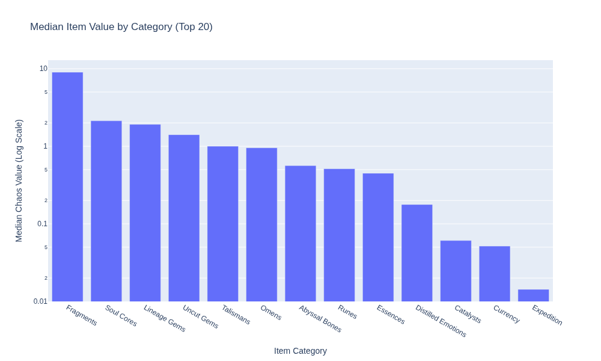
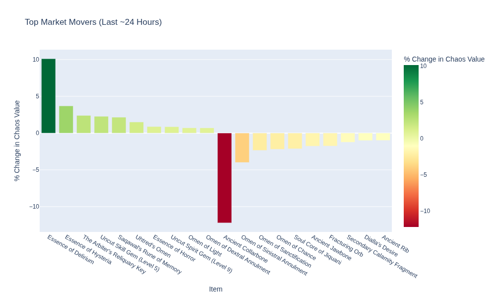

# PoE Economy Tracker for Rise of the Abyssal

<!-- START_MAINTENANCE -->
| Metric | Value |
|:---|:---|
| Last Successful Run (UTC) | `2025-10-28 18:38:16.338656` |
| Total Price Entries in DB | `636,616` |

<!-- END_MAINTENANCE -->

<!-- START_DATAFRAME_DEBUG -->
<!-- END_DATAFRAME_DEBUG -->

<!-- START_CATEGORY_ANALYSIS -->
### Most Valuable Item by Category
| Category | Top Item | Imputed Chaos Value |
| :--- | :--- | :--- |
| Currency | Mirror of Kalandra | 36,827.2 |
| Fragments | Zarokh's Reliquary Key: Temporalis | 13,841.1 |
| Lineage Gems | Arjun's Medal | 1,313.0 |
| Runes | Hedgewitch Assandra's Rune of Wisdom | 754.3 |
| Talismans | Talisman of Sirrius | 410.8 |
| Essences | Essence of Horror | 255.0 |
| Omens | Omen of Chance | 206.2 |
| Soul Cores | Soul Core of Jiquani | 177.8 |
| Abyssal Bones | Ancient Collarbone | 162.3 |
| Uncut Gems | Uncut Spirit Gem (Level 20) | 120.9 |
| Distilled Emotions | Concentrated Liquid Isolation | 10.2 |
| Catalysts | Reaver Catalyst | 1.0 |
| Expedition | Exotic Coinage | 0.1 |

<!-- END_ANALYSIS -->

<!-- START_ANALYSIS -->
### Top 10 Most Valuable Items (Overall)
| Item | Imputed Chaos Value |
| :--- | :--- |
| Mirror of Kalandra | 54,699.9 |
| Hinekora's Lock | 19,049.0 |
| Azmeri Reliquary Key | 7,056.8 |
| Arjun's Medal | 3,194.8 |
| The Trialmaster's Reliquary Key | 1,978.8 |
| Zarokh's Reliquary Key: Against the Darkness | 1,057.3 |
| Ratha's Assault | 763.1 |
| Dialla's Desire | 680.8 |
| Atalui's Bloodletting | 466.8 |
| Uul-Netol's Embrace | 421.4 |

<!-- END_ANALYSIS -->
