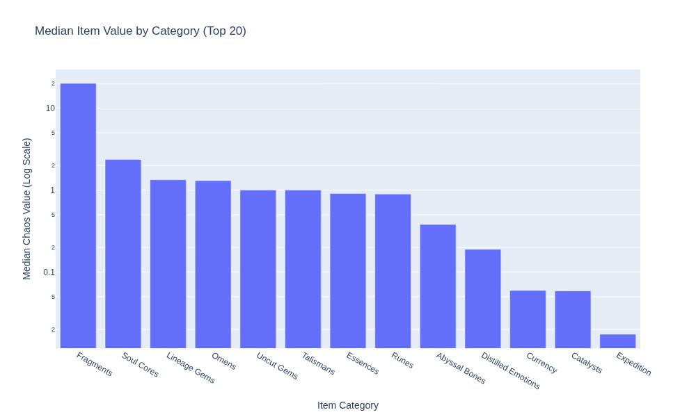

# PoE2 Tracker

This repository tracks Path of Exile 2 data.

## Maintenance Status

<!-- START_MAINTENANCE -->
| Metric | Value |
|:---|:---|
| Last Successful Run (UTC) | `2025-10-01 20:22:29.343131` |
| Total Price Entries in DB | `22,711` |

<!-- END_MAINTENANCE -->

## Category Analysis

<!-- START_CATEGORY_ANALYSIS -->
### Most Valuable Item by Category
| Category | Top Item | Imputed Chaos Value |
| :--- | :--- | :--- |
| Omens | Omen of the Liege | 13,923.4 |
| Lineage Gems | Dialla's Desire | 580.2 |
| Runes | Hedgewitch Assandra's Rune of Wisdom | 358.0 |
| Soul Cores | Soul Core of Tzamoto | 179.0 |
| Talismans | Talisman of Sirrius | 137.6 |
| Abyssal Bones | Ancient Collarbone | 135.3 |
| Essences | Essence of Horror | 84.7 |
| Uncut Gems | Uncut Spirit Gem (Level 20) | 71.8 |
| Fragments | Tertiary Calamity Fragment | 33.0 |
| Currency | Divine Orb | 19.9 |
| Distilled Emotions | Concentrated Liquid Isolation | 9.8 |
| Catalysts | Reaver Catalyst | 0.8 |
| Expedition | Exotic Coinage | 0.0 |

<!-- END_CATEGORY_ANALYSIS -->

## Market Movers & Overall Value

<!-- START_ANALYSIS -->
### Top 10 Most Valuable Items (Overall)
| Item | Imputed Chaos Value |
| :--- | :--- |
| Omen of the Liege | 13,923.4 |
| Dialla's Desire | 580.2 |
| Rakiata's Flow | 383.2 |
| Hedgewitch Assandra's Rune of Wisdom | 358.0 |
| Farrul's Rune of the Chase | 332.4 |
| Countess Seske's Rune of Archery | 217.3 |
| Varashta's Blessing | 198.9 |
| Soul Core of Tzamoto | 179.0 |
| Uhtred's Omen | 170.2 |
| Atalui's Bloodletting | 167.3 |

<!-- END_ANALYSIS -->

---
