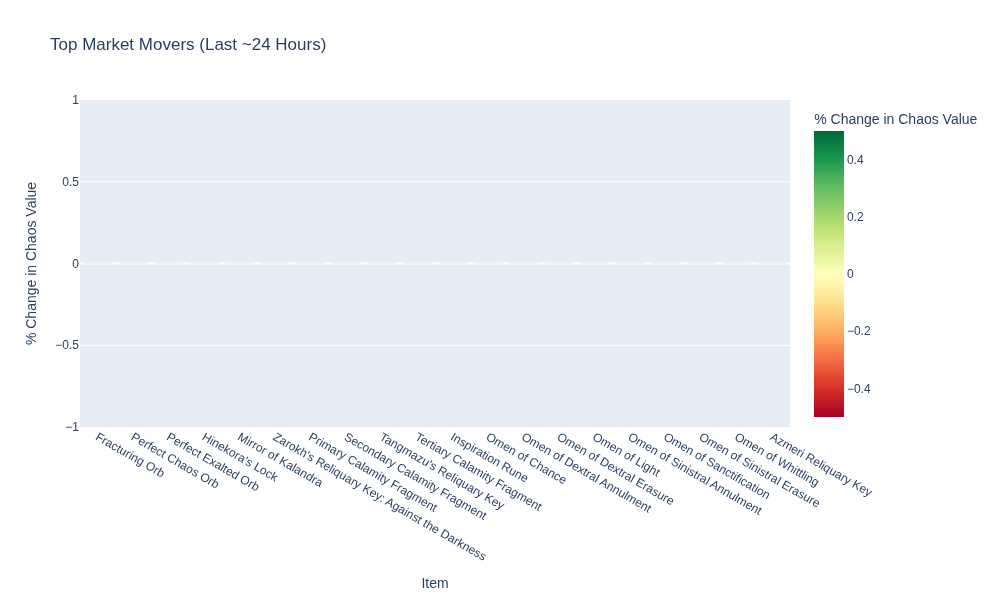

# PoE2 Tracker

This repository tracks Path of Exile 2 data.

## Maintenance Status

<!-- START_MAINTENANCE -->
| Metric | Value |
|:---|:---|
| Last Successful Run (UTC) | `2025-09-30 06:53:50.617425` |
| Total Price Entries in DB | `17,838` |

<!-- END_MAINTENANCE -->

## Category Analysis

<!-- START_CATEGORY_ANALYSIS -->
### Most Valuable Item by Category
| Category | Top Item | Chaos Value |
| :--- | :--- | :--- |
| Currency | Lesser Jeweller's Orb | 650.0 |
| Delirium | Diluted Liquid Ire | 159.1 |
| Essences | Greater Essence of Electricity | 70.0 |
| Breach | Breach Splinter | 68.8 |
| Ritual | Petition Splinter | 50.8 |
| Expedition | Broken Circle Artifact | 37.8 |
| Runes | Greater Glacial Rune | 23.0 |
| UncutGems | Uncut Skill Gem (Level 17) | 18.3 |
| Abyss | Preserved Rib | 17.2 |
| LineageSupportGems | Arakaali's Lust | 7.0 |
| Fragments | Twilight Reliquary Key | 4.3 |
| Talismans | Talisman of Eeshta | 1.0 |
| Ultimatum | Citaqualotl's Soul Core of Foulness | 1.0 |

<!-- END_CATEGORY_ANALYSIS -->

## Market Movers & Overall Value

<!-- START_ANALYSIS -->
### Top 10 Most Valuable Items (Overall)
| Item | Chaos Value |
| :--- | :--- |
| Lesser Jeweller's Orb | 650.0 |
| Scroll of Wisdom | 411.7 |
| Greater Orb of Transmutation | 355.7 |
| Orb of Augmentation | 264.3 |
| Diluted Liquid Ire | 159.1 |
| Orb of Alchemy | 111.5 |
| Greater Orb of Augmentation | 94.1 |
| Orb of Transmutation | 90.4 |
| Greater Essence of Electricity | 70.0 |
| Breach Splinter | 68.8 |

### Top 10 Gainers (24h)
| Item | Chaos Value | % Change |
| :--- | :--- | :--- |
| Orb of Alchemy | 111.45744680851064 | 0.0% |
| Exalted Orb | 13.497088758576837 | 0.0% |
| Artificer's Orb | 11.857142857142858 | 0.0% |
| Orb of Augmentation | 264.275 | 0.0% |
| Glassblower's Bauble | 16.03076923076923 | 0.0% |
| Arcanist's Etcher | 29.80808080808081 | 0.0% |
| Greater Regal Orb | 14.928571428571429 | 0.0% |
| Regal Orb | 22.384615384615383 | 0.0% |
| Armourer's Scrap | 42.84542211652794 | 0.0% |
| Lesser Jeweller's Orb | 650.0 | 0.0% |

### Top 10 Losers (24h)
| Item | Chaos Value | % Change |
| :--- | :--- | :--- |
| Diluted Liquid Ire | 159.0857142857143 | 0.0% |
| Liquid Envy | 24.736842105263158 | 0.0% |
| Liquid Disgust | 12.25 | 0.0% |
| Simulacrum Splinter | 21.21178010471204 | 0.0% |
| Adaptive Catalyst | 17.46031746031746 | 0.0% |
| Breach Splinter | 68.84083212385099 | 0.0% |
| Carapace Catalyst | 22.086021505376344 | 0.0% |
| Xoph's Catalyst | 11.53061224489796 | 0.0% |
| Chayula's Catalyst | 13.946153846153846 | 0.0% |
| Neural Catalyst | 16.70175438596491 | 0.0% |

<!-- END_ANALYSIS -->

---
